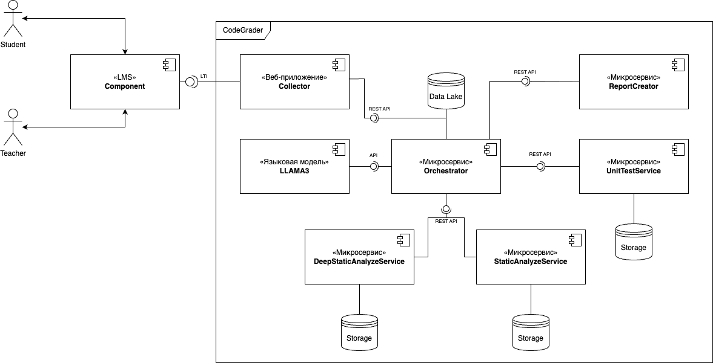

# CodeGrader Service for LMS 

---

Architecture ***v0.1***

---

List of modules
1. [CodeGraderOrchModule](./code-grader/README.md) - Orchestrator module
2. [SyntaxTreeModule](./syntax-tree-module/README.md) - Module for Class analyze on syntax trees
3. [UnitTestModule]() - Module for running unit test 
4. [StaticAnalyzeModule]() - Module for Linter and SpellChecker implementations
5. [CollectorModule]() - Module for collecting terms of reference and students source-code

---

Documentation

For each module you can see documentation in ***SwaggerUI*** format via README.md of modules 